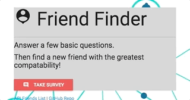
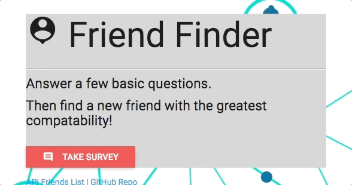

# Friend Finder

 The app is a compatibility-based "FriendFinder" -- basically a dating app. This full-stack site will take in results from your users' surveys, then compare their answers with those from other users. The app will then display the name and picture of the user with the best overall match. 

## Getting Started
https://friendfindersapp.herokuapp.com/

## Demo
Survey

Display a JSON of all possible friends

## Technologies used
- Node.js
- body-parser NPM Package - https://www.npmjs.com/package/body-parser
- express NPM Package - https://www.npmjs.com/package/express
- path NPM Package - https://www.npmjs.com/package/path

## Author
**Julie Nguyen** https://github.com/julienguyen86/FriendFinder